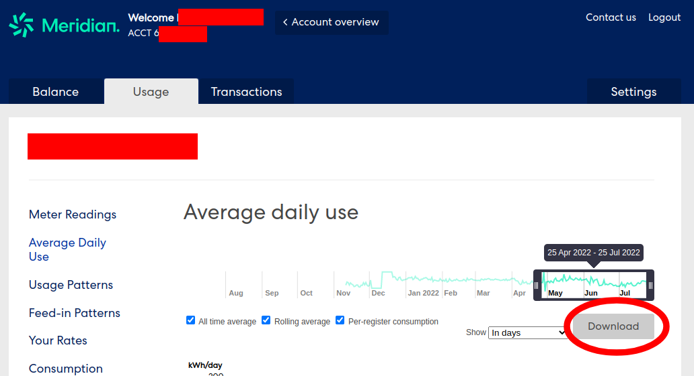

## Meridian Energy Downloader

This project uses Puppeteer (Google Chrome) to automatically download daily usage data as a csv.

https://account.meridianenergy.co.nz/
https://secure.meridianenergy.co.nz/

Essentially automates logining into the service(s) above and clicks the download button here:

#### Requirements

Node.js and NPM
Debian/Ubuntu: `#: apt install node npm`

#### How to use

1. First download & extract or `git clone` this project.
2. Run `npm install`
3. Create a .env (You can copy from the .env.example `cp .env.example .env`)
4. Update the .env with your favorite editor (e.g. `nano .env`)
5. Run `node ./index.js`

#### Security Note

This project requires your meridian email and password to be stored in the .env file as plain text.
Please be careful not to leak your credentials. Use at your own risk.

Additionally Meridian may update their web application and cause this script to stop functioning.

#### Donation

If you find use out of this script, consider buying me a coffee with Bitcoin or don't.
BTC: 3QCnGKxMfak7WZurVpEGkCAxNPcpgDzDGj